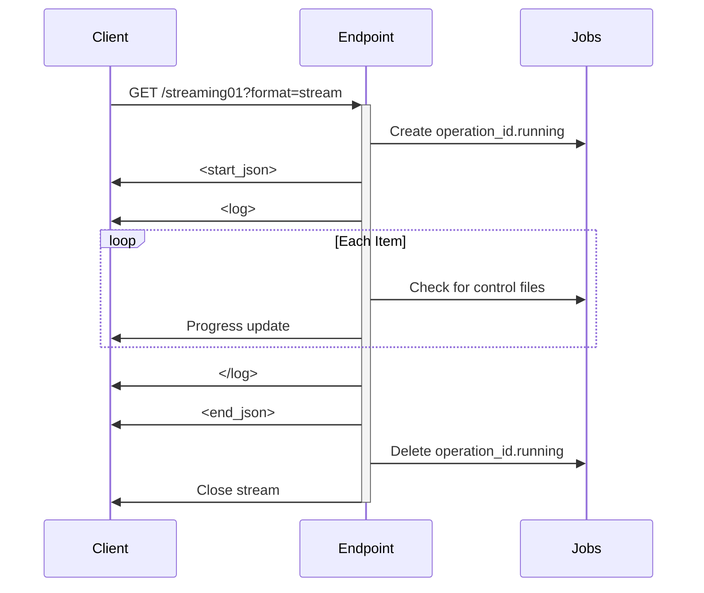
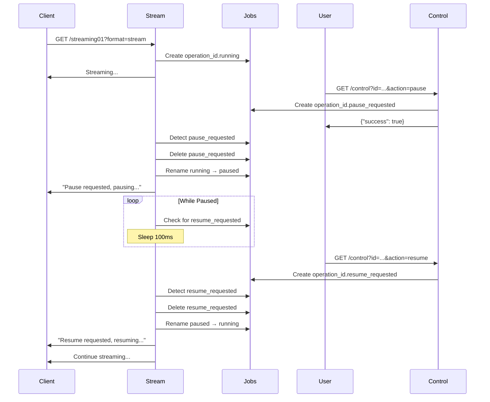
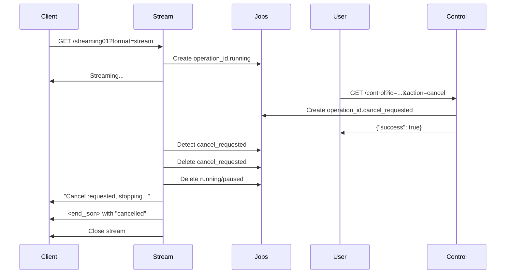

# V1 Streaming Prototype

## Overview

The V1 streaming prototype implements a file-based state management system for long-running operations with pause/resume/cancel capabilities. It uses HTTP streaming responses with structured output and external control via separate HTTP endpoints.

## Architecture

### Core Components

1. **State Management** (`common_job_functions.py`)
   - File-based state tracking
   - Operation ID generation
   - State file CRUD operations

2. **Streaming Endpoint** (`testrouter.py`)
   - Async generator for streaming responses
   - Real-time log output
   - Control file polling

3. **Control Endpoints** (`testrouter.py`)
   - Pause/resume/cancel operations
   - List active operations

## File-Based State Management

### State Folder Structure

```
PERSISTENT_STORAGE_PATH/jobs/
├── testrouter-streaming01_2025-11-26_13-07-00_p16384_r42.running
├── testrouter-streaming01_2025-11-26_13-08-00_p16384_r43.paused
├── testrouter-streaming01_2025-11-26_13-08-00_p16384_r43.pause_requested
└── testrouter-streaming01_2025-11-26_13-09-00_p16384_r44.cancel_requested
```

### State Files

| State File | Purpose | Lifecycle |
|------------|---------|-----------|
| `.running` | Job is actively processing | Created at start, deleted on completion/cancel |
| `.paused` | Job is paused | Created when paused, renamed to `.running` on resume |
| `.pause_requested` | External request to pause | Created by control endpoint, deleted by stream |
| `.resume_requested` | External request to resume | Created by control endpoint, deleted by stream |
| `.cancel_requested` | External request to cancel | Created by control endpoint, deleted by stream |

### Operation ID Format

```
{endpoint_name}_{YYYY-MM-DD}_{HH-MM-SS}_p{PROCESS_ID}_r{REQUEST_NUMBER}
```

**Example**: `testrouter-streaming01_2025-11-26_13-22-00_p16384_r42`

Components:
- **endpoint_name**: Identifies the streaming endpoint
- **timestamp**: When the operation started
- **process_id**: OS process ID
- **request_number**: Sequential request counter from log_data

## Streaming Response Format

### Structure

The streaming response uses a three-section format with XML-like tags for easy parsing:

```xml
<start_json>
{JSON metadata}
</start_json>
<log>
Human-readable log output
</log>
<end_json>
{JSON results}
</end_json>
```

### Header Section

Contains operation metadata sent at the start:

```json
{
  "id": "testrouter-streaming01_2025-11-26_13-22-00_p16384_r42",
  "total": 20
}
```

### Log Section

Real-time progress updates in human-readable format:

```
[ 1 / 20 ] Processing file 'document_001.pdf'...
  OK.
[ 2 / 20 ] Processing file 'document_002.pdf'...
  FAIL: Simulated error for 'document_002.pdf'
[ 3 / 20 ] Processing file 'document_003.pdf'...
  OK.
```

### Footer Section

Final results and statistics:

```json
{
  "result": "partial",
  "state": "completed",
  "total": 20,
  "processed": 18,
  "failed": 2,
  "processed_files": [
    {"filename": "document_001.pdf", "size_bytes": 234567},
    ...
  ],
  "failed_files": [
    {"filename": "document_002.pdf", "error": "Simulated processing error"}
  ]
}
```

**Result values**:
- `"success"` - All items processed successfully
- `"partial"` - Some items failed
- `"cancelled"` - Operation was cancelled

**State values**:
- `"completed"` - Finished normally
- `"cancelled"` - Stopped by user request

## API Endpoints

### Start Streaming Operation

```
GET /testrouter/streaming01?format=stream&files=20
```

**Parameters**:
- `format=stream` - Triggers streaming response
- `files` - Number of files to simulate (default: 20)

**Response**: `text/event-stream; charset=utf-8`

**Behavior**:
1. Generates unique operation ID
2. Creates `.running` state file
3. Streams header JSON
4. Processes items with 200ms delay each
5. Checks for control requests on each iteration
6. Streams footer JSON
7. Deletes state file on completion

### Control Operation

```
GET /testrouter/control?id={operation_id}&action={action}
```

**Parameters**:
- `id` - Operation ID from header JSON
- `action` - One of: `pause`, `resume`, `cancel`

**Response**: JSON confirmation

```json
{
  "success": true,
  "id": "testrouter-streaming01_2025-11-26_13-22-00_p16384_r42",
  "action": "pause",
  "message": "Pause requested for operation '...'"
}
```

**Behavior**:
1. Validates operation exists (has `.running` or `.paused` state file)
2. Creates `{action}_requested` state file
3. Stream detects file and performs action

### List Active Operations

```
GET /testrouter/operations
GET /testrouter/operations?endpoint=testrouter-streaming01
```

**Parameters**:
- `endpoint` - Optional filter by endpoint name

**Response**: JSON list of active operations

```json
{
  "operations": [
    {
      "operation_id": "testrouter-streaming01_2025-11-26_13-22-00_p16384_r42",
      "state": "running"
    },
    {
      "operation_id": "testrouter-streaming01_2025-11-26_13-25-00_p16384_r43",
      "state": "paused"
    }
  ],
  "count": 2
}
```

## Control Flow

### Normal Execution



### Pause/Resume Flow



### Cancel Flow



## Implementation Details

### State File Polling

The stream checks for control files on **every iteration**:

```python
for index, filename in enumerate(simulated_files, start=1):
  # Check for cancel request
  if streaming_state_file_exists(state_folder, operation_id, "cancel_requested"):
    yield f"  Cancel requested, stopping...\n"
    delete_streaming_state_file(state_folder, operation_id, "cancel_requested")
    delete_streaming_state_file(state_folder, operation_id, "running")
    final_state = "cancelled"
    break
  
  # Check for pause request
  if streaming_state_file_exists(state_folder, operation_id, "pause_requested"):
    yield f"  Pause requested, pausing...\n"
    delete_streaming_state_file(state_folder, operation_id, "pause_requested")
    rename_streaming_state_file(state_folder, operation_id, "running", "paused")
  
  # Wait while paused
  while streaming_state_file_exists(state_folder, operation_id, "paused"):
    if streaming_state_file_exists(state_folder, operation_id, "resume_requested"):
      yield f"  Resume requested, resuming...\n"
      delete_streaming_state_file(state_folder, operation_id, "resume_requested")
      rename_streaming_state_file(state_folder, operation_id, "paused", "running")
      break
    await asyncio.sleep(0.1)  # Poll every 100ms
  
  # Process item
  yield f"[ {index} / {total} ] Processing file '{filename}'...\n"
  await asyncio.sleep(0.2)  # Simulate work
```

### State File Content

Each state file contains the timestamp when it was created:

```python
def create_streaming_state_file(state_folder: str, operation_id: str, state: str) -> bool:
  file_path = get_streaming_state_file_path(state_folder, operation_id, state)
  if not file_path: return False
  with open(file_path, 'w') as f:
    f.write(datetime.datetime.now().isoformat())
  return True
```

**Example file content**: `2025-11-26T13:22:45.123456`

### Cleanup

State files are cleaned up automatically:

1. **On completion**: `.running` file deleted
2. **On cancel**: All state files deleted (`.running`, `.paused`, `.cancel_requested`)
3. **On control action**: Request files deleted after being processed

## Key Functions

### `common_job_functions.py`

| Function | Purpose |
|----------|---------|
| `get_streaming_state_folder()` | Returns jobs folder path, creates if needed |
| `generate_streaming_operation_id()` | Creates unique operation ID |
| `get_streaming_state_file_path()` | Builds full path to state file |
| `create_streaming_state_file()` | Creates state file with timestamp |
| `delete_streaming_state_file()` | Removes state file |
| `streaming_state_file_exists()` | Checks if state file exists |
| `rename_streaming_state_file()` | Renames state file (e.g., running → paused) |
| `get_streaming_current_state()` | Returns current state (running/paused/None) |
| `list_streaming_operations()` | Lists all active operations |

### `utils.py` (imported by testrouter)

Functions used from utils:
- `log_function_header()` - Logs function entry, returns log_data with request_number
- `log_function_footer()` - Logs function exit with duration

## Advantages

1. **Simple**: No database required, just file operations
2. **Stateless HTTP**: Control via separate requests, no WebSocket needed
3. **Resilient**: State persists across server restarts
4. **Observable**: State files visible in filesystem
5. **Debuggable**: Easy to inspect and manually modify state
6. **Multi-process safe**: File operations are atomic

## Limitations

1. **Polling overhead**: Checks filesystem on every iteration
2. **No persistence**: Completed operations leave no trace
3. **No history**: Can't query past operations
4. **Limited metadata**: Only operation ID and state stored
5. **File system dependency**: Requires shared filesystem for multi-server
6. **No progress tracking**: Can't query current progress externally
7. **Manual cleanup**: Failed operations may leave orphaned state files

## Example Usage

### Client-Side Streaming

```javascript
const response = await fetch('/testrouter/streaming01?format=stream&files=20');
const reader = response.body.getReader();
const decoder = new TextDecoder();

let buffer = '';
while (true) {
  const {done, value} = await reader.read();
  if (done) break;
  
  buffer += decoder.decode(value, {stream: true});
  
  // Parse header
  if (buffer.includes('</start_json>')) {
    const headerMatch = buffer.match(/<start_json>\n(.*?)\n<\/start_json>/s);
    const header = JSON.parse(headerMatch[1]);
    console.log('Operation ID:', header.id);
  }
  
  // Display logs in real-time
  const logMatch = buffer.match(/<log>\n(.*?)(?:<\/log>|$)/s);
  if (logMatch) {
    console.log(logMatch[1]);
  }
  
  // Parse footer when complete
  if (buffer.includes('</end_json>')) {
    const footerMatch = buffer.match(/<end_json>\n(.*?)\n<\/end_json>/s);
    const footer = JSON.parse(footerMatch[1]);
    console.log('Result:', footer);
  }
}
```

### Controlling Operations

```javascript
// Pause
await fetch(`/testrouter/control?id=${operationId}&action=pause`);

// Resume
await fetch(`/testrouter/control?id=${operationId}&action=resume`);

// Cancel
await fetch(`/testrouter/control?id=${operationId}&action=cancel`);

// List active
const ops = await fetch('/testrouter/operations').then(r => r.json());
console.log('Active operations:', ops.operations);
```

## Future Enhancements (V2)

Potential improvements for the next version:

1. **Persistent job records**: Store job metadata in JSON files or database
2. **Progress tracking**: Store current_item/total_items in state
3. **Job history**: Keep completed/failed job records
4. **Richer metadata**: Store start time, end time, error details
5. **Job queuing**: Support for scheduled/queued jobs
6. **Better cleanup**: Automatic orphaned file detection
7. **WebSocket support**: Real-time updates without polling
8. **Multi-server support**: Distributed state management
9. **Job retry**: Automatic retry on failure
10. **Job dependencies**: Chain jobs together

## Configuration

The jobs folder location is configured in `hardcoded_config.py`:

```python
CRAWLER_HARDCODED_CONFIG = CrawlerHardcodedConfig(
  PERSISTENT_STORAGE_PATH_JOBS_SUBFOLDER="jobs"
  ...
)
```

This creates the structure:
```
PERSISTENT_STORAGE_PATH/
├── domains/
├── crawler/
└── jobs/          # Streaming operation state files
```

## Related Files

- `src/common_job_functions.py` - State management functions
- `src/routers/testrouter.py` - Streaming endpoint implementation
- `src/hardcoded_config.py` - Configuration constants
- `src/utils.py` - Logging utilities
