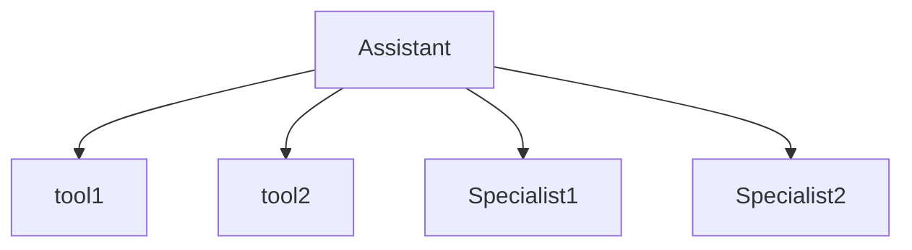

# INFO: Agent Visualization

**Doc ID**: OASDKP-IN32
**Goal**: Document agent graph visualization capabilities
**SDK Version**: openai-agents 0.8.3

**Sources:**
- `OASDKP-SC-GHIO-VISUALIZATION` - Visualization documentation

## Summary

The SDK provides visualization utilities to generate diagrams of agent relationships, tools, and handoffs. This helps understand complex multi-agent architectures by producing visual representations of the agent graph. Visualizations can be exported as Mermaid diagrams or rendered directly in Jupyter notebooks. [VERIFIED]

## Basic Visualization

```python
from agents import Agent
from agents.visualization import draw_graph

agent = Agent(
    name="Assistant",
    instructions="...",
    tools=[tool1, tool2],
    handoffs=[specialist1, specialist2],
)

# Generate Mermaid diagram
mermaid_code = draw_graph(agent)
print(mermaid_code)
```

## Output Format



## Multi-Agent Graph

```python
from agents import Agent
from agents.visualization import draw_graph

triage = Agent(name="Triage", handoffs=[sales, support])
sales = Agent(name="Sales", tools=[crm_tool])
support = Agent(name="Support", tools=[ticket_tool], handoffs=[escalation])
escalation = Agent(name="Escalation", instructions="...")

# Visualize entire graph
draw_graph(triage)
```

## Jupyter Integration

```python
from agents.visualization import display_graph

# Renders inline in Jupyter
display_graph(agent)
```

## Export Options

```python
from agents.visualization import draw_graph

# Get Mermaid code
mermaid = draw_graph(agent, format="mermaid")

# Save to file
with open("agent_graph.md", "w") as f:
    f.write(f"```mermaid\n{mermaid}\n```")
```

## Customization

```python
draw_graph(
    agent,
    show_tools=True,       # Include tools in graph
    show_handoffs=True,    # Include handoffs
    show_instructions=False,  # Exclude instructions (default)
    max_depth=3,           # Limit handoff depth
)
```

## Use Cases

- Documentation generation
- Architecture review
- Debugging handoff paths
- Onboarding new team members
- Presentations

## Best Practices

- Generate graphs after major changes
- Include in project documentation
- Use depth limits for complex graphs
- Review for unexpected handoff paths

## Related Topics

- `_INFO_OASDKP-IN14_MULTIAGENT.md` [OASDKP-IN14] - Multi-agent patterns
- `_INFO_OASDKP-IN13_HANDOFFS.md` [OASDKP-IN13] - Handoffs

## API Reference

### Functions

- **draw_graph()**
  - Import: `from agents.visualization import draw_graph`
  - Returns: Mermaid diagram string

- **display_graph()**
  - Import: `from agents.visualization import display_graph`
  - Purpose: Jupyter inline rendering

## Document History

**[2026-02-11 11:53]**
- Initial visualization documentation created
